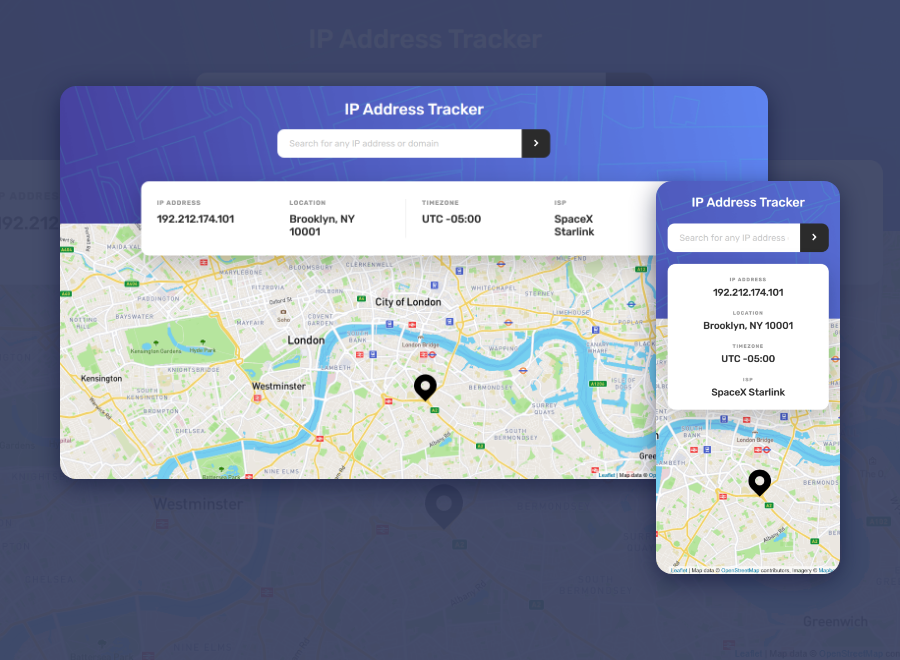

# Frontend Mentor - Blogr landing page solution

### Screenshot

### Links

- Solution URL: [Frontendmentor](https://www.frontendmentor.io/solutions/ip-address-tracker-vanilla-js-sass-Tq2dv5iti)
- Live Site URL: [Vercel](https://ip-address-tracker-master-orcin.vercel.app/)

### Built with

- Semantic HTML5 markup
- Flexbox
- CSS Grid
- Vanilla JS
- [Sass](https://sass-lang.com/)
